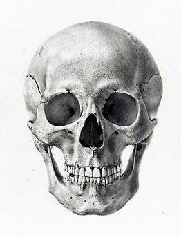
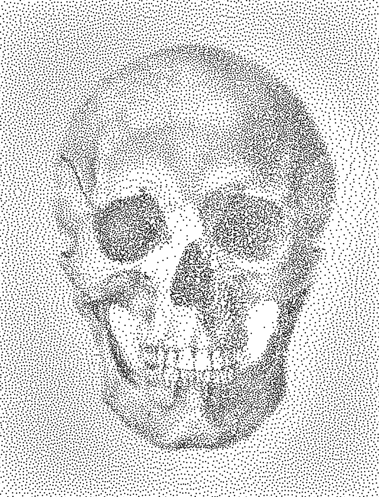
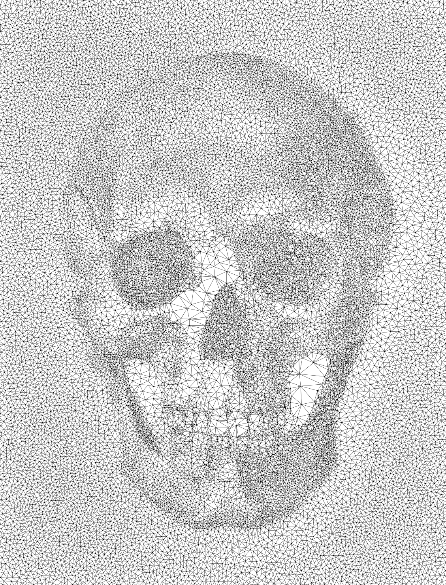
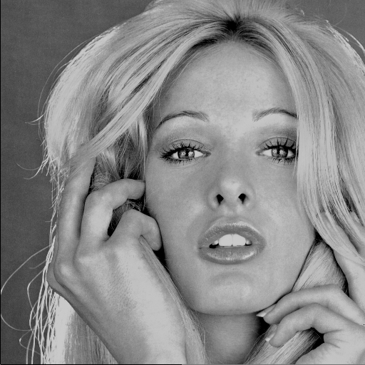
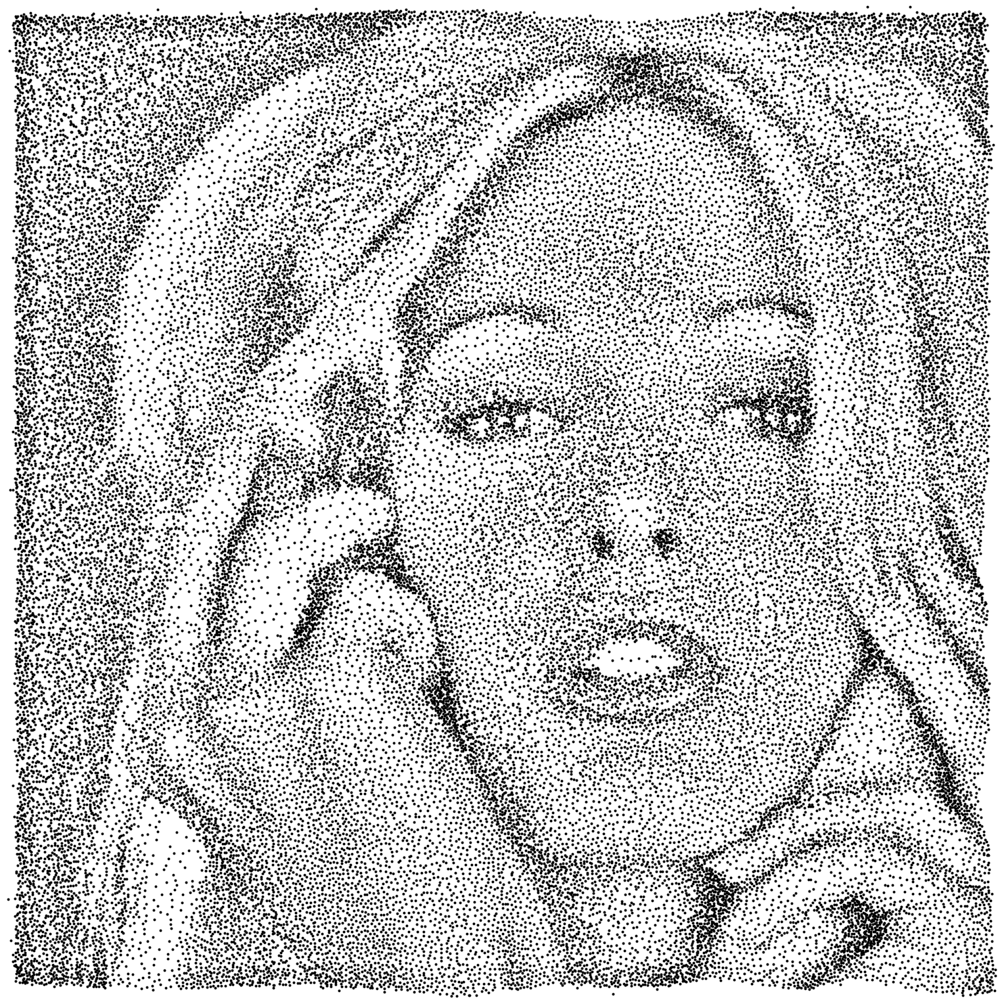
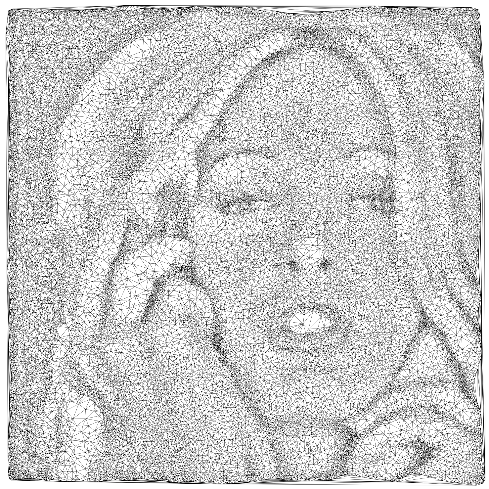
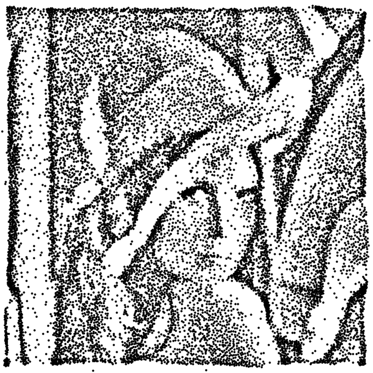

# Particle Repulsion Mesher

## Information

+ **Author:** Vladislav A. Yastrebov
+ **Afffiliation:** CNRS, MINES Paris - PSL
+ **License:** BSD 3-Clause License
+ **Date:** April 26, 2024
+ **Note:** The code is provided as is and the author is not responsible for any damage caused by the code.
+ **AI usage:** GPT4 and copilot were used to co-construct the code.

## Description

This is a code that converts grayscale image a set of particles using repulsion algorithm which cluster to darker regions.
Code based on the particle Electrostatic halftoning [1], but essentially on the details provided on the associated web-page [2]

## References

+ [1] Schmaltz, C., Gwosdek, P., Bruhn, A. and Weickert, J., 2010, December. Electrostatic halftoning. In Computer Graphics Forum (Vol. 29, No. 8, pp. 2313-2327). Oxford, UK: Blackwell Publishing Ltd. [doi](https://doi.org/10.1111/j.1467-8659.2010.01716.x)

+ [2] Web-page: [www.mia.uni-saarland.de/Research/Electrostatic_Halftoning/index.shtml](https://www.mia.uni-saarland.de/Research/Electrostatic_Halftoning/index.shtml)

## Examples

### Skull I

 
 
 

### Woman

### Lena

