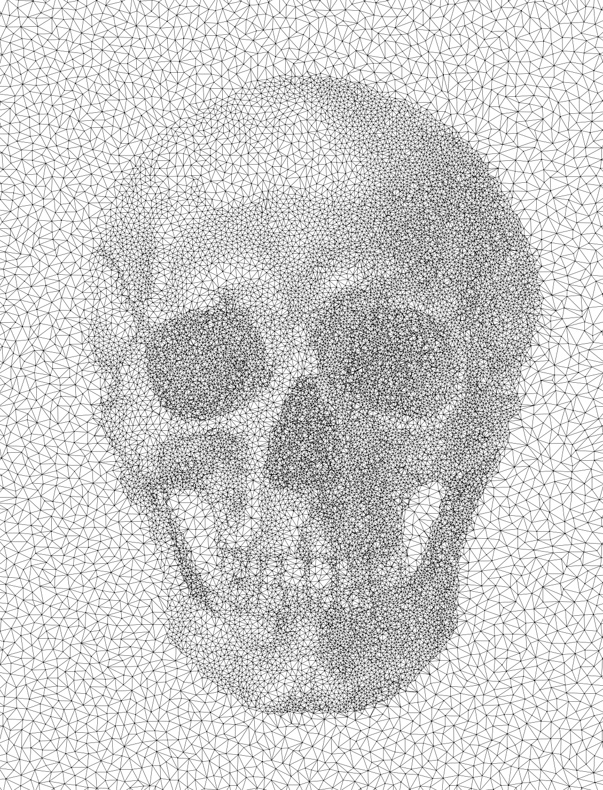

# Electrostatic-Based Mesher: from image (error estimator) to Delaunay mesh

## Information

+ **Author:** Vladislav A. Yastrebov
+ **Afffiliation:** CNRS, MINES Paris - PSL
+ **License:** BSD 3-Clause License
+ **Date:** April 26-30, 2024
+ **Note:** The code is provided as is and the author is not responsible for any damage caused by the code.
+ **AI usage:** GPT4 and copilot were used to co-construct the code.

## Description

This is a code that converts grayscale image a set of particles using repulsion/attraction algorithm (electrostatic interaction).
Positively charged particles with the charge proportional to the normalized darkness $q\in[0,1]$ of the pixel location are distributed on a regular grid with a random position and are kept fixed. Negatively charged particles $q=-1$ are distributed at pixel locations (in v2, the probability to have a particle is proportional to the level of darkness at the current location).
We use the gradient descent to make particles clusterize near dark regions thanks to the attractive forces, and in lighter regions thanks to the repulsive forces, the particles distribute rather evenly. Note that only negative particles move and only they are rendered in the output image.
Particles' location is used to construct Delaunay triangulation, which is used to generate the mesh. The mesh is rendered in the output image if `Mesh = True`.
Code based on the particle Electrostatic halftoning [1], but essentially on the details provided on the associated web-page [2] with some modifications concerning the gradient descent and the mesh generation.

Version 2 (current one) apart from fast convergence and better control over the particles' distribution, ensures a more accurate follow-up of the image's features.

## References

+ [1] Schmaltz, C., Gwosdek, P., Bruhn, A. and Weickert, J., 2010, December. Electrostatic halftoning. In Computer Graphics Forum (Vol. 29, No. 8, pp. 2313-2327). Oxford, UK: Blackwell Publishing Ltd. [doi](https://doi.org/10.1111/j.1467-8659.2010.01716.x)

+ [2] Web-page: [www.mia.uni-saarland.de/Research/Electrostatic_Halftoning/index.shtml](https://www.mia.uni-saarland.de/Research/Electrostatic_Halftoning/index.shtml)

## Requirements

+ Python 3.7 or higher
+ Numba
+ Numpy
+ Matplotlib
+ PIL
+ Scipy
+ ffmpeg [optional] for frame to video conversion if needed.

## Usage

The code can be run from the command line as follows:

```bash
python Particles_repulsion.py image_name.png
```

where `image_name.png` is the path to the image file. 
All parameters are set in the code itself.
```python
    cutoff = 20             # Cutoff distance for electrostatic forces
    force_factor = 0.5      # Factor making a link between displacement increment and the acting force
    total_frames = 20       # Number of computed frames/iterations to stabilize the particles
    particle_size = 1.25    # Size of the particles in the output image
    DPI = 400               # Resolution of the output image
    eps_regulation = 0.1    # Regularization parameter to prevent division by zero in force calculation (in pixel size)
    Mesh = False            # If True, the mesh is generated
# *Extra parameters for v2*
    zero_probability_offset = 0. # Offset for the probability to have a particle at a given location; to keep white - white keep it zero, to add some particles at the purely white background this parameter represent the probability (between 0 and 1) to have a particle at white background.
```

The code will generate the following files:

+ `log_TIMESTAMP.txt` - log file with the information about the run
+ `image_name_particle_frame_xx.png` - images of the particles if `Mesh = False`, with `xx` being the frame number; `image_name_particle_animation.mp4` - video of the particles' motion if `Mesh = False`;
+ `image_name_mesh_frame_xx.png` - images of the mesh if `Mesh = True`;
+ `image_name_mesh_animation.mp4` - video of the mesh if `Mesh = True`.

For more control over the animation one can use `Tools/Convert_frames_to_fmpeg.sh` script to convert the frames to the video, it is based of `ffmpeg` tool.


## Examples 

### Skull

+ Original image


Original image from [Look and Learn]( https://www.lookandlearn.com/history-images/YW072217L/Drawing-of-a-human-skull-facing-forwards) distributed under CC BY 4.0 by Joseph Barnard Davis and John Thurnam. 

+ Mesh: initial and final state (CC BY 4)

 

See animation of the mesh equilibration in `Examples/Skull_II_v2/skull_mesh_2.mp4`.

<!-- <video controls src="Examples/Skull_II_v2/skull_mesh_2.mp4" width = "100%" title="Mesh equilibration animation"></video> -->

+ Particles: initial and final state (CC BY 4)

 

See animation of particles' equilibration in `Examples/Skull_II_v2/skull_particles_2.mp4`.

<!-- <video controls src="Examples/Skull_II_v2/skull_particles_2.mp4" width = "100%" title="Particles equilibration animation"></video> -->

### Kitten

+ Original image


Original image CC but the authors was not identified.

+ Mesh: initial and final state (CC BY 4)

 

+ Particles: initial and final state (CC BY 4)

 

### Trui

+ Original image


+ Mesh: initial and final state

 

+ Particles: initial and final state

 


---
---
---

## Old Examples (produced by an obsolete version)

I keep them for their aesthetic value, but they are not representative of the current version of the code.

### Skull

   

Original image from [Look and Learn]( https://www.lookandlearn.com/history-images/YW072217L/Drawing-of-a-human-skull-facing-forwards) distributed under CC BY 4.0 by Joseph Barnard Davis and John Thurnam. 
Derivatives CC BY 4.0.

### Tiffany

  

Original image by [Tiffany](http://78.108.103.11/~fojtik/gallery/gray/woman1.gif), license is unknown, but broadly used in image analysis literature.
Derivatives CC BY 4.0.

### Lena

  

Original "Permission = Use of this 512x512 scan is "overlooked" and by implication permitted by Playboy. Alexander Sawchuk et al scanned the image and cropped it specifically for distribution for use by image compression researchers, and hold no copyright on it." [Wikipedia](https://en.wikipedia.org/wiki/Lenna). 
Derivatives CC BY 4.0

### Kitten

  

Original image CC but the authors was not identified. Derivatives CC BY 4.0.
