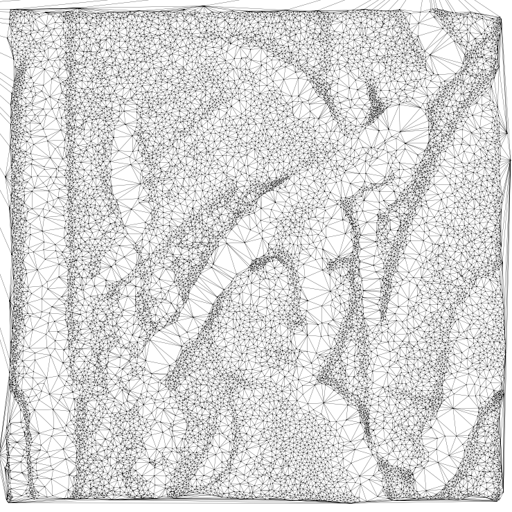

# Particle Repulsion Mesher

## Information

+ **Author:** Vladislav A. Yastrebov
+ **Afffiliation:** CNRS, MINES Paris - PSL
+ **License:** BSD 3-Clause License
+ **Date:** April 26, 2024
+ **Note:** The code is provided as is and the author is not responsible for any damage caused by the code.
+ **AI usage:** GPT4 and copilot were used to co-construct the code.

## Description

This is a code that converts grayscale image a set of particles using repulsion algorithm which cluster to darker regions.
Code based on the particle Electrostatic halftoning [1], but essentially on the details provided on the associated web-page [2]

## References

+ [1] Schmaltz, C., Gwosdek, P., Bruhn, A. and Weickert, J., 2010, December. Electrostatic halftoning. In Computer Graphics Forum (Vol. 29, No. 8, pp. 2313-2327). Oxford, UK: Blackwell Publishing Ltd. [doi](https://doi.org/10.1111/j.1467-8659.2010.01716.x)

+ [2] Web-page: [www.mia.uni-saarland.de/Research/Electrostatic_Halftoning/index.shtml](https://www.mia.uni-saarland.de/Research/Electrostatic_Halftoning/index.shtml)

## Requirements

+ Python 3.7 or higher
+ Numba
+ Numpy
+ Matplotlib
+ PIL
+ Scipy
+ ffmpeg [optional] for frame to video conversion if needed.


## Usage

The code can be run from the command line as follows:

```bash
python Particles_repulsion.py image_name.png
```

where `image_name.png` is the path to the image file. 
All parameters are set in the code itself.
```python
    num_particles = 30000   # Number of particles
    cutoff = 20             # Cutoff distance for repulsive forces (in pixels of the original image)
    force_factor = 0.1      # Factor making a link between displacement increment and the acting force
    total_frames = 25       # Number of computed frames in the output video
    particle_size = 0.5     # Size of the particles in the output image
    DPI = 400               # Resolution of the output image
    Mesh = True             # If True, the mesh is generated
```

The code will generate the following files:

+ `log.txt` - log file with the information about the run
+ `image_name_particle_frame_xx.png` - images of the particles if `Mesh = False`, with `xx` being the frame number; `image_name_particle_animation.mp4` - video of the particles' motion if `Mesh = False`;
+ `image_name_mesh_frame_xx.png` - images of the mesh if `Mesh = True`;
+ `image_name_mesh_animation.mp4` - video of the mesh if `Mesh = True`.

For more control over the animation one can use `Tools/Convert_frames_to_fmpeg.sh` script to convert the frames to the video, it is based of `ffmpeg` tool.


## Examples

### Skull I

 
 
 

### Woman


### Lena



